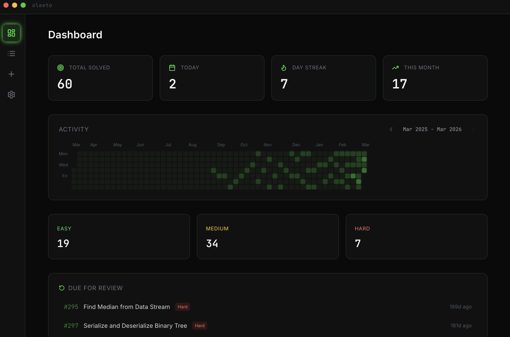
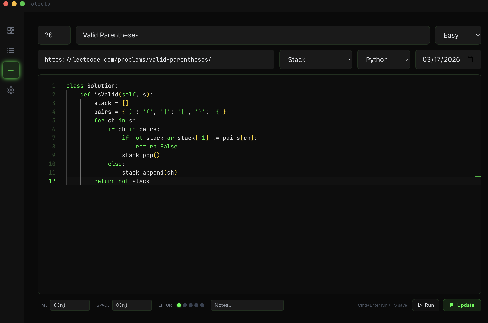
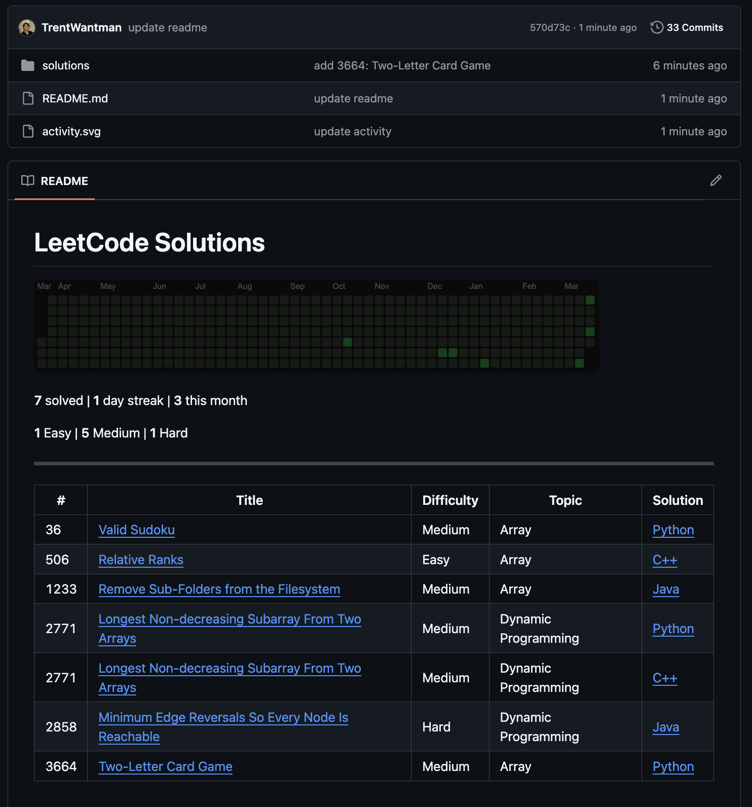
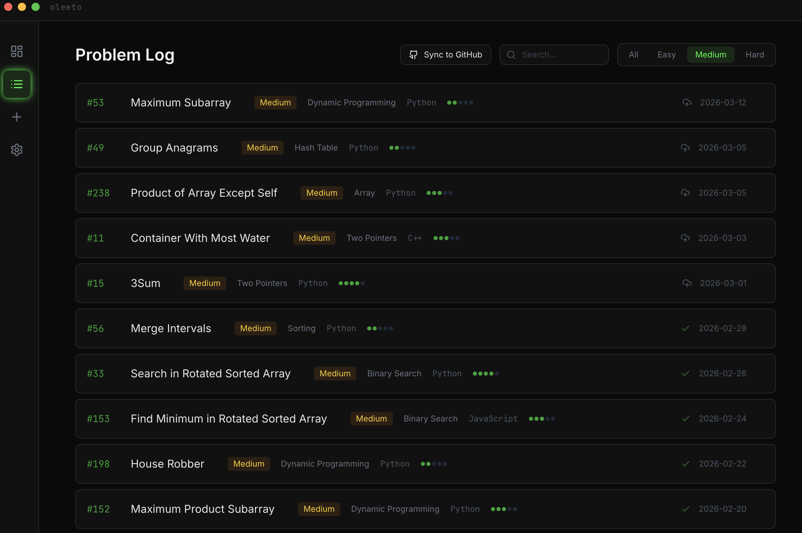
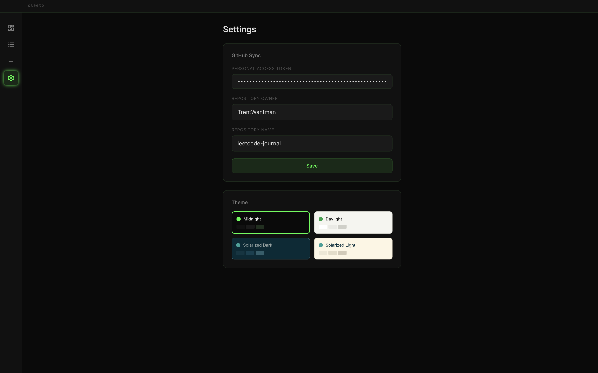

# oleeto

A desktop app for tracking your LeetCode grind. Write code, run it, log your solves, and sync everything to a clean GitHub repo.

[trentwantman.github.io/oleeto-landing](https://trentwantman.github.io/oleeto-landing/)



## What it does

- Log problems with number, title, difficulty, topic, language, and your solution
- Paste a LeetCode URL and the problem info fills in automatically
- Write and run code in a built-in editor with syntax highlighting
- Time and space complexity detected from your code
- Track your activity with a heatmap, streak counter, and monthly stats
- Sync to GitHub with one click per problem or all at once
- Your GitHub repo gets an auto-generated README with a visual heatmap, stats, and a full problem index



## Generates Leetcode Journal Repo

- Your GitHub repo gets an auto-generated README with a visual heatmap, stats, and a full problem index



## Install

```bash
brew install --cask TrentWantman/tap/oleeto
```

Or download the `.dmg` from [Releases](https://github.com/TrentWantman/oleeto/releases/latest). macOS requires this after installing:

```bash
xattr -cr /Applications/Oleeto.app
```

Build from source:

```bash
git clone https://github.com/TrentWantman/oleeto.git
cd oleeto
npm install
npm run dev
```

## Package

```bash
npm run build && npm run package
```

Outputs a `.dmg` to the `release/` directory.



## Stack

- Electron
- React, TypeScript, Tailwind CSS
- Monaco editor
- SQLite (better-sqlite3)
- Octokit for GitHub sync



## Keyboard Shortcuts

| Shortcut | Action |
|----------|--------|
| Cmd+Enter | Run solution |
| Cmd+S | Save problem |

## License

MIT
